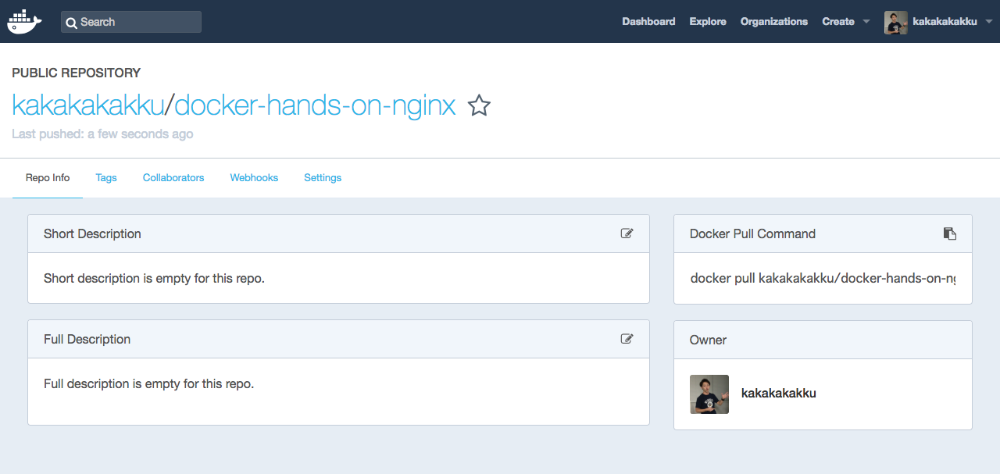

# docker-hands-on

[](https://github.com/kakakakakku/docker-hands-on/stargazers)

## 前提

Docker ハンズオン資料は以下の環境を前提に動作確認をしています．

- [Docker Community Edition for Mac](https://store.docker.com/editions/community/docker-ce-desktop-mac)

## 環境準備

Docker Community Edition をインストールします．バージョンは最新にします．


インストール後に `docker` コマンドを実行できるようになっていれば，正常にインストールできています．

```sh
$ which docker
/usr/local/bin/docker

$ docker -v
Docker version 18.06.0-ce, build 0ffa825

$ docker info
```

## `hello-world` コンテナを実行する

Docker Community Edition の動作確認も兼ねて，さっそくコンテナを実行してみましょう．今回は Docker から公式に提供されている `hello-world` イメージを使います．

- [library/hello-world - Docker Hub](https://hub.docker.com/_/hello-world/)

以下のように `docker run hello-world` と実行します．`docker run` は指定したイメージを実行するコマンドです．`Hello from Docker!` と表示されていれば，正常に実行できています．

```sh
$ docker run hello-world

Unable to find image 'hello-world:latest' locally
latest: Pulling from library/hello-world
9db2ca6ccae0: Pull complete
（中略）

Hello from Docker!
This message shows that your installation appears to be working correctly.

（中略）
```

次に `docker imeges` と実行します．ダウンロードしたイメージを確認することができます．今回使った `hello-world` イメージはたった `1.85kB` と非常に軽量です．

```sh
$ docker image ls
REPOSITORY                            TAG                 IMAGE ID            CREATED             SIZE
hello-world                           latest              2cb0d9787c4d        5 weeks ago         1.85kB
```

## `nginx` コンテナを実行する

もう少し実践的なコンテナを実行してみましょう．次は nginx 公式の `nginx` イメージを使います．

- [library/nginx - Docker Hub](https://hub.docker.com/r/library/nginx/)

少しオプションが増えました．`-d` はコンテナプロセスをバックグラウンド実行する場合に指定します．`-p` はコンテナ内部のポートに接続する場合に指定します．今回は動作環境の `8888` ポートをコンテナ内部の `80` ポートに接続しています．

```sh
$ docker run -d -p 8888:80 nginx

Unable to find image 'nginx:latest' locally
latest: Pulling from library/nginx
be8881be8156: Pull complete
32d9726baeef: Pull complete
87e5e6f71297: Pull complete
（中略）
```

さっそく `http://localhost:8888/` に接続してみましょう．すると nginx に接続できます．


次に `docker container ls` と実行します．`docker container ls` は実行中のコンテナを一覧するコマンドです．続けて `docker container kill` と実行し，コンテナを停止します．すると nginx に接続できなくなります．

```sh
$ docker container ls
CONTAINER ID        IMAGE               COMMAND                  CREATED             STATUS              PORTS                  NAMES
3185885edcfb        nginx               "nginx -g 'daemon of…"   8 minutes ago       Up 8 minutes        0.0.0.0:8888->80/tcp   relaxed_shaw

$ docker container kill 3185885edcfb
3185885edcfb
```

## `nginx` コンテナをカスタマイズする

次に `nginx` イメージをベースにカスタマイズをしてみましょう．具体的には任意の `index.html` を追加したイメージを作成します．

まず，任意のディレクトリに kakakakakku/docker-hands-on リポジトリをクローンしましょう．事前に `dockerfiles/nginx` ディレクトリに `Dockerfile` と `index.html` を用意しています．`Dockerfile` はイメージの構築手順を記述したファイルです．`index.html` は今回 nginx に読み込ませるファイルです．

```sh
$ git clone https://github.com/kakakakakku/docker-hands-on.git
$ cd docker-hands-on
$ ls -l dockerfiles/nginx
```

`Dockerfile` は非常にシンプルです．先ほど動作確認をした `nginx` イメージをベースに `index.html` をコンテナ内部の `/usr/share/nginx/html/index.html` に配置しています．`COPY` はローカルからコンテナ内部にファイルをコピーするときに使います．

```
FROM nginx

COPY ./index.html /usr/share/nginx/html/index.html
```

さっそくイメージをビルドしてみましょう．以下のように `docker build` コマンドを実行します．今回は `docker-hands-on-nginx` というコンテナ名にしましょう．すぐにイメージが作成できます．

```sh
$ docker build -t docker-hands-on-nginx dockerfiles/nginx/
（中略）
Successfully tagged docker-hands-on-nginx:latest

$ docker image ls
REPOSITORY                            TAG                 IMAGE ID            CREATED             SIZE
docker-hands-on-nginx                 latest              e5c40748c226        27 hours ago        109MB
```

カスタマイズしたイメージをすぐに実行できます．先ほどと同じ `docker run` コマンドを実行しましょう．

```sh
$ docker run -d -p 8888:80 docker-hands-on-nginx
```

改めて `http://localhost:8888/` に接続すると，カスタマイズした `index.html` を確認できます．


## Docker Hub にイメージを公開する

作成した `docker-hands-on-nginx` イメージを Docker Hub に公開しましょう．最初に Docker Hub でアカウントを取得します．

- [Docker Hub](https://hub.docker.com/)
- [kakakakakku - Docker Hub](https://hub.docker.com/u/kakakakakku/)

取得したアカウントを環境変数に設定します（ハンズオン資料として手順を共通化するためです）．

```sh
$ export DOCKER_HUB_ACCOUNT=xxxxxxxxxx
$ echo ${DOCKER_HUB_ACCOUNT}
```

次に Docker Hub にログインをします．

```sh
$ docker login
（中略）
Login Succeeded
```

次にイメージを Docker Hub に公開します．今回は `docker tag` コマンドでイメージ名にアカウント名を追加し，`docker push` で Docker Hub に公開しています．

```sh
$ docker tag docker-hands-on-nginx ${DOCKER_HUB_ACCOUNT}/docker-hands-on-nginx

$ docker push ${DOCKER_HUB_ACCOUNT}/docker-hands-on-nginx
```

自分の Docker Hub を確認すると，以下のように正常にイメージが公開できています．


