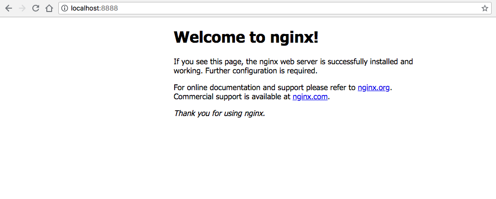

# docker-hands-on

[](https://github.com/kakakakakku/docker-hands-on/stargazers)

## 前提

Docker ハンズオン資料は以下の環境を前提に動作確認をしています．

- [Docker Community Edition for Mac](https://store.docker.com/editions/community/docker-ce-desktop-mac)

## 環境準備

Docker Community Edition をインストールします．バージョンは最新にします．


インストール後に `docker` コマンドを実行できるようになっていれば，正常にインストールできています．

```sh
$ which docker
/usr/local/bin/docker

$ docker -v
Docker version 18.06.0-ce, build 0ffa825

$ docker info
```

## `hello-world` コンテナを実行する

Docker Community Edition の動作確認も兼ねて，さっそくコンテナを実行してみましょう．今回は Docker から公式に提供されている `hello-world` イメージを使います．

- [library/hello-world - Docker Hub](https://hub.docker.com/_/hello-world/)

以下のように `docker run hello-world` と実行します．`docker run` は指定したイメージを実行するコマンドです．`Hello from Docker!` と表示されていれば，正常に実行できています．

```sh
$ docker run hello-world

Unable to find image 'hello-world:latest' locally
latest: Pulling from library/hello-world
9db2ca6ccae0: Pull complete
（中略）

Hello from Docker!
This message shows that your installation appears to be working correctly.

（中略）
```

次に `docker imeges` と実行します．ダウンロードしたイメージを確認することができます．今回使った `hello-world` イメージはたった `1.85kB` と非常に軽量です．

```sh
$ docker image ls
REPOSITORY                            TAG                 IMAGE ID            CREATED             SIZE
hello-world                           latest              2cb0d9787c4d        5 weeks ago         1.85kB
```

## `nginx` コンテナを実行する

もう少し実践的なコンテナを実行してみましょう．次は nginx 公式の `nginx` イメージを使います．

- [library/nginx - Docker Hub](https://hub.docker.com/r/library/nginx/)

少しオプションが増えました．`-d` はコンテナプロセスをバックグラウンド実行する場合に指定します．`-p` はコンテナ内部のポートに接続する場合に指定します．今回は動作環境の `8888` ポートをコンテナ内部の `80` ポートに接続しています．

```sh
$ docker run -d -p 8888:80 nginx

Unable to find image 'nginx:latest' locally
latest: Pulling from library/nginx
be8881be8156: Pull complete
32d9726baeef: Pull complete
87e5e6f71297: Pull complete
（中略）
```

さっそく `http://localhost:8888/` に接続してみましょう．すると nginx に接続できます．



次に `docker container ls` と実行します．`docker container ls` は実行中のコンテナを一覧するコマンドです．続けて `docker container kill` と実行し，コンテナを停止します．すると nginx に接続できなくなります．

```sh
$ docker container ls
CONTAINER ID        IMAGE               COMMAND                  CREATED             STATUS              PORTS                  NAMES
3185885edcfb        nginx               "nginx -g 'daemon of…"   8 minutes ago       Up 8 minutes        0.0.0.0:8888->80/tcp   relaxed_shaw

$ docker container kill 3185885edcfb
3185885edcfb
```

## 2. 手動でコンテナを構築する

### 2-1. CentOS の Docker イメージを取得する

`docker images` で結果が表示されたら正常に取得できている．

```sh
➜  ~  docker images
➜  ~  docker pull centos:centos6
➜  ~  docker images
REPOSITORY           TAG                 IMAGE ID            CREATED             VIRTUAL SIZE
centos               centos6             a005304e4e74        7 weeks ago         203.1 MB
```

### 2-2. コンテナを起動して httpd をインストールする

コンテナ内のオペレーションは PS1 が `[]` になっている．

httpd を起動してデフォルトページが返ってくるのを確認できたら正常にインストールできている．

```sh
➜  ~  docker run -it centos:centos6 /bin/bash

[root@c0a5325eebaf /]# yum install -y httpd
（中略）
Complete!
[root@c0a5325eebaf /]# service httpd start
[root@c0a5325eebaf /]# curl http://localhost
```

ここで別のターミナルを開いて `docker ps` と `docker ps -a` を叩いてみる．

現在はコンテナが稼働しているため，どちらのコマンドを使っても，コンテナプロセスを確認することができる．

```
➜  ~  docker ps
CONTAINER ID        IMAGE               COMMAND             CREATED             STATUS              PORTS               NAMES
c0a5325eebaf        centos:centos6      "/bin/bash"         7 minutes ago       Up 7 minutes                            goofy_bohr

➜  ~  docker ps -a
CONTAINER ID        IMAGE                COMMAND                CREATED             STATUS                     PORTS               NAMES
c0a5325eebaf        centos:centos6       "/bin/bash"            7 minutes ago       Up 7 minutes                                   goofy_bohr
```

### 2-3. コンテナを停止する

コンテナを停止する．

```sh
[root@c0a5325eebaf /]# exit
exit
```

停止したらもう1度 `docker ps` と `docker ps -a` を叩いてみる．

オプションを付けないと稼働中のコンテナだけが表示されることがわかる．

* [ps](https://docs.docker.com/reference/commandline/ps/)

```sh
➜  ~  docker ps
dCONTAINER ID        IMAGE               COMMAND             CREATED             STATUS              PORTS               NAMES

➜  ~  docker ps -a
CONTAINER ID        IMAGE                COMMAND                CREATED             STATUS                          PORTS               NAMES
c0a5325eebaf        centos:centos6       "/bin/bash"            10 minutes ago      Exited (0) About a minute ago                       goofy_bohr
```

### 2-4. httpd コンテナをイメージにする

イメージ名は任意で OK だけど `${USERNAME}/${IMAGENAME}` にする慣習に沿う．

`CONTAINER ID` は `docker ps -a` で表示されたものを指定する．

```sh
➜  ~  docker commit c0a5325eebaf kakakakakku/manual-httpd
4021b02c4720fc422d14ca7477121586d006dbc5f48faa0e74c607f5f01d09b5

➜  ~  docker images
REPOSITORY                 TAG                 IMAGE ID            CREATED             VIRTUAL SIZE
kakakakakku/manual-httpd   latest              4021b02c4720        13 seconds ago      257.5 MB
centos                     centos6             a005304e4e74        7 weeks ago         203.1 MB
```

### 2-5. httpd イメージを Mac にポートマッピングをした状態で起動する

Mac の 8080 ポートを Docker コンテナの 80 ポートにマッピングした状態で，既に作った httpd イメージを起動する．

この時点では httpd は落ちているため起動する．

```
➜  ~  docker run -p 8080:80 -it kakakakakku/manual-httpd /bin/bash
[root@9b4ad6f91ea7 /]# service httpd start
```

別のターミナルを開いて Docker が起動してる IP を確認しておく．

```sh
➜  ~ docker-machine ip
192.168.59.103
```

Chrome などのブラウザで `http://192.168.59.103:8080` にアクセスして接続できることを確認する．

### 2-6. コンテナの生存期間を体験する

コンテナ上で `Control + p, Control + q` と入力するとターミナルからデタッチすることができる．

普通に `exit` をしてしまうとコンテナが停止してしまうが，デタッチするとコンテナは稼働したままになる．

```sh
➜  ~  docker ps
CONTAINER ID        IMAGE                      COMMAND             CREATED             STATUS              PORTS                  NAMES
9b4ad6f91ea7        kakakakakku/manual-httpd   "/bin/bash"         6 minutes ago       Up 6 minutes        0.0.0.0:8080->80/tcp   grave_bell
```

この状態でブラウザから接続しても，引き続き `http://192.168.59.103:8080` にアクセスできることがわかる．

次にコンテナを外から停止してみる．

```sh
➜  ~  docker stop 9b4ad6f91ea7
9b4ad6f91ea7
```

するとコンテナが停止するため，アクセスできなくなる．

この一連の流れで，コンテナの生存期間を体験することができたと思う．

## 3. Dockerfile を使ってイメージを作る

僕が作ってる Dockerfile は以下のリポジトリにまとめている．

* [Kakakakakku/dockerfiles](https://github.com/Kakakakakku/dockerfiles)

### 3-1. httpd コンテナを構築する Dockerfile を作成する

`my_docker` のように任意のディレクトリを作成して `Dockerfile` を作成する．

```sh
➜  my_docker  vim Dockerfile
```

各項目の詳細はリファレンスに書いてある．

* [Dockerfile reference](https://docs.docker.com/reference/builder/)

```
FROM centos:centos6
MAINTAINER Yoshiaki Yoshida <y.yoshida22@gmail.com>

RUN yum install -y httpd
EXPOSE 80
CMD ["/usr/sbin/httpd", "-D", "FOREGROUND"]
```

### 3-2. Dockerfile からイメージを構築する

```sh
➜  my_docker  docker build -t kakakakakku/httpd .
（中略）
Successfully built 0507c25b6917
```

正常にビルドが完了するとイメージが構築されていることがわかる．

```sh
➜  my_docker  docker images
REPOSITORY                 TAG                 IMAGE ID            CREATED             VIRTUAL SIZE
kakakakakku/httpd          latest              0507c25b6917        20 seconds ago      257.5 MB
```

### 3-3. 構築したイメージを起動する

今回はバックグラウンド起動を意味した `-d` をオプションで起動する．

```sh
➜  my_docker  docker run -p 8080:80 -d kakakakakku/httpd
8096ff4df716407d554896b4590644530ec29e0e7225f5126001578ffc9f3547
```

この状態で既に `http://192.168.59.103:8080` にアクセスできるようになっている．

先ほどと同様にコンテナを外から停止する．

```sh
➜  my_docker  docker ps
CONTAINER ID        IMAGE               COMMAND                CREATED             STATUS              PORTS                  NAMES
8096ff4df716        kakakakakku/httpd   "/usr/sbin/httpd -D    2 minutes ago       Up 2 minutes        0.0.0.0:8080->80/tcp   furious_torvalds

➜  my_docker  docker stop 8096ff4df716
8096ff4df716
```

## 4. Docker Hub にイメージを公開する

### 4-1. Docker Hub のアカウントを取得する

以下で取得できる．個人のページを見ることもできる．

* [Docker Hub](https://hub.docker.com/)
* [Docker Hub - kakakakakku](https://hub.docker.com/u/kakakakakku/)

### 4-2. Docker Hub に push する

対象のイメージを確認しておく．

```sh
➜  my_docker  docker images
REPOSITORY                 TAG                 IMAGE ID            CREATED             VIRTUAL SIZE
kakakakakku/httpd          latest              0507c25b6917        7 minutes ago       257.5 MB
```

`docker push` で Docker Hub に登録することができる．

初回に `docker login` で認証をすると `~/.docker/config.json` にファイルが生成される．

```sh
➜  my_docker  docker login
➜  my_docker  docker push kakakakakku/httpd
（中略）
Digest: sha256:6f4444069187b4e10d5b11694b86fd6badc035f8cb3dc7b16e85566d710c65db
```

自分の Docker Hub ページを見て正常に push できていることを確認する．

## 5. Docker Compose で複数コンテナを扱う

### 5-1. サンプルの dockerfiles を取得する

* [Kakakakakku/dockerfiles](https://github.com/Kakakakakku/dockerfiles)

```sh
git clone git@github.com:Kakakakakku/dockerfiles.git
```

### 5-2. Docker Compose をインストールする

以下のマニュアルに書いてある `curl` でインストールする．

* [Docker Compose](https://docs.docker.com/compose/install/)

### 5-3. Docker Compose で Python アプリコンテナと Redis コンテナを同時に起動する

```sh
➜  dockerfiles git:(master) cd compose_hits_app
➜  compose_hits_app git:(master) docker-compose up
```

この状態で `http://192.168.59.103:5000/` にアクセスすると，Redis でアクセスカウンターアプリを起動させることができる．

# まとめ

Docker 超入門お疲れさまでした！

# Tips

## コマンド補完

`.zshrc` にプラグイン指定をしておくとコマンド補完が使えて便利．

```
plugins=(docker docker-compose)
```
